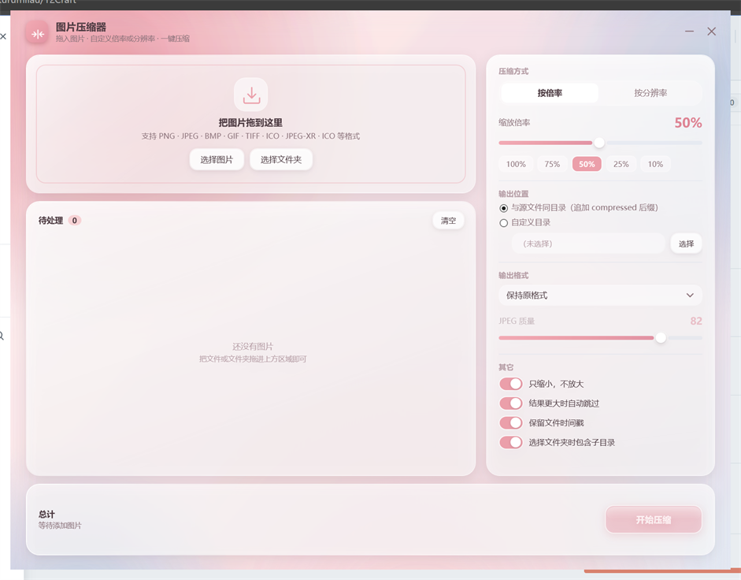
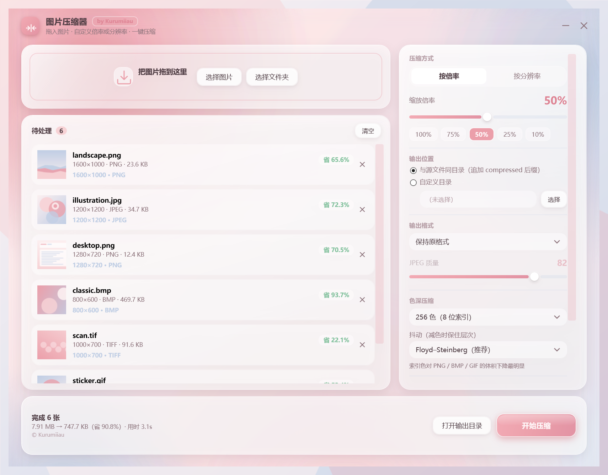

# 图片压缩器 · ImgZip

> **作者：Kurumiiau** · MIT License

一个 **Windows 桌面小工具**：把图片和视频拖进去，一键变小。




## 它能做什么

**图片压缩**（PNG / JPEG / WebP / HEIC / BMP / GIF / TIFF / ICO…）

- 按 **倍率**（1%–100%）或 **目标分辨率** 缩放，可锁宽高比、只缩不放
- **色深压缩**：256/128/…/2 色索引、灰度、黑白，体积直接砍到零头
- 批量处理，拖拽即用，输出到原目录（文件名加 `_compressed`，绝不覆盖原图）

**视频压缩**（MP4 / MKV / AVI / MOV / WebM / FLV / WMV / TS…）

- 同样支持倍率 / 目标分辨率缩放，以及灰度、黑白
- **GPU 加速**：检测到 N 卡 / A 卡 / Intel 核显时自动用硬件编码，速度数倍提升、CPU 几乎不忙；没有 GPU 自动退回 CPU
- 实测：一段 60 秒 1440p 视频，10 秒压完，**197 MB → 15.7 MB**

## 安装

下载 [Releases](https://github.com/Kurumiiau/ImgZip/releases) 页面的 **`ImgZip-Setup-1.2.0.msi`**，双击安装即可。

- 用户级安装，**不需要管理员权限**
- 自带 ffmpeg，视频压缩开箱即用
- 开始菜单 / 桌面快捷方式自动创建，可在「设置 → 应用」中正常卸载
- 前置条件：.NET 8 桌面运行时 (x64)，缺失时安装包会给出下载地址

不想安装？解压 [便携版 zip](https://github.com/Kurumiiau/ImgZip/releases) 直接运行 `ImgZip.exe` 也可以。

## 命令行（可选）

同一个 exe 支持无界面批处理：

```bat
ImgZip.exe --cli --in "D:\照片" --scale 50            :: 图片缩到 50%
ImgZip.exe --cli --in "D:\视频" --width 1920          :: 视频压到 1080p
ImgZip.exe --cli --in a.mp4 --scale 50 --cpu          :: 强制 CPU 编码
ImgZip.exe --help                                     :: 全部参数
```

## 许可

[MIT License](LICENSE) © 2026 **Kurumiiau**
